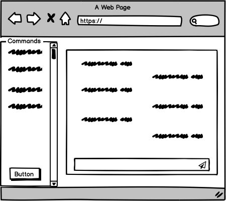
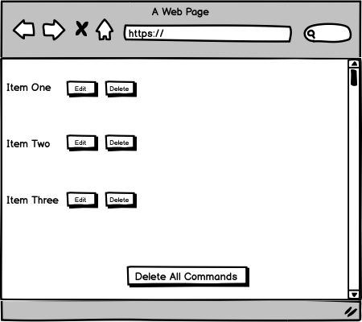

# GA Project#2: ChatFox 

This project was built as a requirement in Misk Academy-General Assembly Software Engineering Course.

## Table of Contents

  * [Overview](#overview)

  * [Technologies](#tech)

  * [Development Process](#dev)

  * [Future Work](#future)

  * [Favorite Functionality](#fav)

## Overview 

The main idea of this project is to build a chatbot where the user or in the future, the admin can edit and delete its commands.

## Technologies 

1. React js

2. Chrome Developer Tools

3. Axios

4. React Bootstrap

5. Github

## User Stories

1. As a user, I want to send a phrase and then the chatbot responds with a message.

2. As a user, I want to add a command to the chatbot.

3. As a user, I want to edit a command from the chatbot commands.

4. As a user, I want to delete a command from the chatbot commands.

5. As a user, I want to delete all commands from the chatbot commands.

6. As a user, I want to play an audio when I click on audio icon in chatbot's messages.

## Wireframes 

## Development Process 

At first, I was going to call a chatbot API which has some commands for the chatbot, and in my web app I would let the user edit or delete a command or all of the commands, and interact with the chatbot. Each time the user query a phrase or a question, the chatbot would call its api for the response. But as I was exploring different apis, I couldn't find a chatbot the meets my requirements, so I made the queries inside the chatbot itself.

## Future Work 

1. Make the chatbot more advanced, where it takes multiple responses for a phrase and returns a random one.

2. Implement notification messages when adding a command and a confirmation message when attempting to delete a/all command(s).

## Favorite functionality 

My favorite functionality and the most complex one in this project, is displaying the chat where the user send a message and the bot responds.